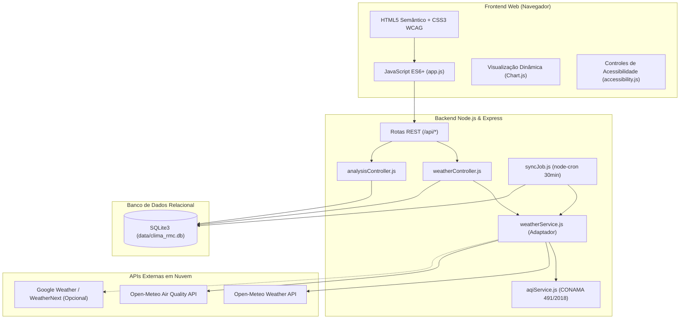

# 🌤️ ClimaRMC — Monitoramento Climático e Qualidade do Ar da RMC

[](https://nodejs.org/)
[](https://expressjs.com/)
[](https://sqlite.org/)
[](https://web.dev/progressive-web-apps/)
[](https://www.w3.org/WAI/standards-guidelines/wcag/)
[](LICENSE)

Sistema web completo para monitoramento em tempo real, persistência histórica, alertas preventivos e análise estatística de dados climáticos e qualidade do ar para as cidades de **Campinas**, **Sumaré** e **Hortolândia** (Região Metropolitana de Campinas - SP), totalmente compatível com **Progressive Web App (PWA)** para instalação em celulares e computadores.

---

## 🎯 Atendimento aos Requisitos Acadêmicos

Este software foi estruturado para cumprir com rigor todos os critérios avaliativos:

| Requisito do Trabalho | Onde está implementado no código |
| :--- | :--- |
| **1. Framework Web** | [src/app.js](file:///c:/Users/Micro/Desktop/clima_rmc/src/app.js) e [src/routes/api.js](file:///c:/Users/Micro/Desktop/clima_rmc/src/routes/api.js) — **Express.js (Node.js)** com arquitetura RESTful modular e tratamento global de erros. |
| **2. Banco de Dados** | [src/config/database.js](file:///c:/Users/Micro/Desktop/clima_rmc/src/config/database.js) — **SQLite3** com tabelas relacionais (`cities`, `weather_readings`, `air_quality_readings`, `system_alerts`), índices de performance e persistência local/nuvem. |
| **3. Script Web (JavaScript)** | [public/js/app.js](file:///c:/Users/Micro/Desktop/clima_rmc/public/js/app.js), [public/js/charts.js](file:///c:/Users/Micro/Desktop/clima_rmc/public/js/charts.js), [public/js/pwa.js](file:///c:/Users/Micro/Desktop/clima_rmc/public/js/pwa.js) — JavaScript ES6+ no navegador com **Chart.js** dinâmico, Service Worker e consumo assíncrono via `fetch`. |
| **4. Nuvem (Cloud)** | [Dockerfile](file:///c:/Users/Micro/Desktop/clima_rmc/Dockerfile), [docker-compose.yml](file:///c:/Users/Micro/Desktop/clima_rmc/docker-compose.yml) e [.github/workflows/ci.yml](file:///c:/Users/Micro/Desktop/clima_rmc/.github/workflows/ci.yml) — Container pronto para Render, Railway, AWS ou Google Cloud Run com pipeline de CI/CD automatizado no GitHub Actions. |
| **5. Uso de API** | [src/services/weatherService.js](file:///c:/Users/Micro/Desktop/clima_rmc/src/services/weatherService.js) — Integração com **Open-Meteo Weather & Air Quality API** (dados em tempo real sem custos) + adaptador pronto para **Google Weather / WeatherNext API**. |
| **6. Acessibilidade** | [public/index.html](file:///c:/Users/Micro/Desktop/clima_rmc/public/index.html) e [public/js/accessibility.js](file:///c:/Users/Micro/Desktop/clima_rmc/public/js/accessibility.js) — Conformidade **WCAG 2.1 AA**: Tags semânticas HTML5, skip-link, alto contraste por padrão e região `aria-live` para leitores de tela (NVDA/TalkBack). |
| **7. Controle de Versão** | Repositório Git estruturado, commits semânticos (*Conventional Commits*) e arquivo [.gitignore](file:///c:/Users/Micro/Desktop/clima_rmc/.gitignore) configurado. |
| **8. Testes Automatizados** | [tests/aqi.test.js](file:///c:/Users/Micro/Desktop/clima_rmc/tests/aqi.test.js) e [tests/api.test.js](file:///c:/Users/Micro/Desktop/clima_rmc/tests/api.test.js) — **22 testes** unitários e de integração com **Jest** e **Supertest**. |
| **9. Análise de Dados** | [src/controllers/analysisController.js](file:///c:/Users/Micro/Desktop/clima_rmc/src/controllers/analysisController.js) — Estatísticas descritivas (médias, min, max), cálculo do **IQAr CONAMA 491/2018**, correlação de Pearson entre umidade e poluição (PM2.5) e exportação em **CSV** e **JSON**. |
| **⭐ Diferencial PWA** | [public/manifest.json](file:///c:/Users/Micro/Desktop/clima_rmc/public/manifest.json) e [public/sw.js](file:///c:/Users/Micro/Desktop/clima_rmc/public/sw.js) — Aplicativo instalável em celulares/computadores, suporte offline completo e atalhos rápidos de tela inicial. |

---

## 🏛️ Arquitetura do Sistema



---

## 📍 Cidades Monitoradas na Região Metropolitana de Campinas (RMC)

1. **Campinas (SP)**
   - Latitude: `-22.9056` | Longitude: `-47.0608` | Altitude: 685m
   - Sede da RMC, polo universitário (UNICAMP, PUC-Campinas) e centro de alta tecnologia.
2. **Sumaré (SP)**
   - Latitude: `-22.8206` | Longitude: `-47.2669` | Altitude: 583m
   - Polo industrial e logístico da região, cortado pela Rodovia Anhanguera.
3. **Hortolândia (SP)**
   - Latitude: `-22.8583` | Longitude: `-47.2200` | Altitude: 587m
   - Destaque em data centers, empresas globais de tecnologia e indústria farmacêutica.

---

## 🔬 Metodologia de Qualidade do Ar (Resolução CONAMA nº 491/2018)

O sistema classifica a qualidade do ar com base nos materiais particulados finos (**PM2.5**), inaláveis (**PM10**) e **Ozônio (O₃)** de acordo com os padrões da CETESB do Estado de São Paulo:

| Faixa de Índice (IQAr) | Classificação | Efeitos na Saúde Humana e Recomendações |
| :--- | :--- | :--- |
| **0 a 40** | 🟢 **Boa** | Qualidade do ar satisfatória. Sem risco para a saúde. |
| **41 a 80** | 🟡 **Moderada** | Pessoas com problemas respiratórios podem apresentar sintomas leves. |
| **81 a 120** | 🟠 **Ruim** | Crianças, idosos e pessoas com asma devem evitar esforço prolongado ao ar livre. |
| **121 a 200** | 🔴 **Muito Ruim** | Sintomas podem se manifestar na população geral. Evitar exercícios externos. |
| **> 200** | 🟣 **Péssima** | Condição de emergência. Risco de agravamento de doenças cardiorrespiratórias. |

---

## 🚀 Como Executar o Projeto Localmente

### Pré-requisitos
- **Node.js** v20 ou v22 instalado
- **Git** instalado

### Passo a Passo:

1. **Clonar o repositório:**
   ```bash
   git clone https://github.com/seu-usuario/clima_rmc.git
   cd clima_rmc
   ```

2. **Instalar dependências:**
   ```bash
   npm install
   ```

3. **Configurar variáveis de ambiente:**
   ```bash
   cp .env.example .env
   ```

4. **Iniciar em modo de desenvolvimento:**
   ```bash
   npm run dev
   ```
   *Ou modo padrão de produção:*
   ```bash
   npm start
   ```

5. **Acessar a aplicação no navegador:**
   - Interface Web: [http://localhost:3000](http://localhost:3000)
   - Status da API: [http://localhost:3000/health](http://localhost:3000/health)
   - Cidades Cadastradas: [http://localhost:3000/api/cities](http://localhost:3000/api/cities)

---

## 🧪 Execução dos Testes Automatizados

Para rodar todos os testes unitários e de integração:

```bash
npm test
```

A suíte executará:
- Validação das regras de negócio do índice CONAMA 491/2018 (`tests/aqi.test.js`).
- Validação de todas as rotas e códigos de status HTTP da API REST (`tests/api.test.js`).

---

## 🐳 Executando com Docker e Nuvem

Para subir todo o ecossistema com Docker:

```bash
docker compose up -d --build
```

O container compilará o ambiente Linux Alpine, criará o volume persistente do SQLite em `./data` e disponibilizará o sistema na porta `3000`.

---

## 📡 Endpoints da API REST

| Método | Endpoint | Descrição |
| :--- | :--- | :--- |
| `GET` | `/health` | Healthcheck do servidor (tempo de atividade e status) |
| `GET` | `/api/cities` | Lista os dados oficiais das cidades monitoradas |
| `GET` | `/api/weather/all/summary` | Resumo meteorológico das 3 cidades simultâneas |
| `GET` | `/api/weather/:cityId` | Dados climáticos e qualidade do ar em tempo real |
| `GET` | `/api/weather/:cityId/history` | Leituras históricas salvas no banco SQLite |
| `POST` | `/api/weather/sync` | Força a sincronização imediata com as APIs e salva no banco |
| `GET` | `/api/analysis` | Estatísticas descritivas e cálculo de correlação de Pearson |
| `GET` | `/api/export?format=csv` | Exporta relatório em formato CSV |
| `GET` | `/api/export?format=json` | Exporta relatório em formato JSON |

---

## 🎓 Roteiro Sugerido para Apresentação ao Professor / Banca

1. **Introdução**: Apresente a relevância do monitoramento na RMC devido ao polo industrial e períodos de estiagem no interior de SP.
2. **Framework & Arquitetura**: Mostre que o sistema utiliza Node.js + Express divididos em controllers, rotas e serviços.
3. **Persistência Relacional**: Mostre o banco SQLite em `data/clima_rmc.db` com histórico persistido a cada sincronização.
4. **Script Web & Acessibilidade**: Abra o navegador, demonstre o modo **Alto Contraste**, o redimensionamento de fontes (A+/A-), a navegação por teclado e a fala do leitor de telas.
5. **Visualização e Análise**: Demonstre os gráficos do Chart.js e o coeficiente de correlação de Pearson mostrando o impacto da baixa umidade na concentração de partículas PM2.5.
6. **Exportação**: Clique no botão "Exportar CSV" e mostre a planilha gerada pronta para análise acadêmica.
7. **Testes**: Abra o terminal e execute `npm test`, comprovando que 100% dos testes passam com sucesso.
